# Ddos-detection-using-ML-DL-Models
# DDoS Detection using Machine Learning and Deep Learning

This project presents a comprehensive system for detecting Distributed Denial-of-Service (DDoS) attacks using a variety of machine learning and deep learning models. The approach includes data preprocessing, exploratory data analysis (EDA), model training, and evaluation.

---

## 🚀 Features

- Data preprocessing on a dataset with 100,000+ rows and 20+ features
- Heatmap for missing values
- Feature distribution analysis: numerical, categorical, and continuous
- Visualizations for attack types and protocols
- Baseline ML classifiers:  
  - DNN  
  - KNN  
  - SVM  
  - Decision Tree  
  - Naive Bayes  
  - Quadratic Discriminant Analysis (QDA)  
  - SGD  
  - Logistic Regression  
  - XGBoost  
- Model training and performance evaluation
- Visualizations: Loss vs Epochs, Accuracy vs Epochs (for DNN)
- Accuracy comparison of all classifiers

---

## 📁 Project Structure
├── data/ # Dataset folder

├── notebooks/ # Jupyter notebooks for each step

├── models/ # Saved model files (optional)

├── plots/ # Output figures

├── README.md # Project documentation

└── requirements.txt # Python dependencies


---
## FlowChart
## 🔄 Workflow Overview

```mermaid
flowchart TD
    A[Start: Import Essential Modules] --> B[Load Dataset<br/>104,345 rows × 23 columns]
    
    B --> C[Data Preprocessing Phase]
    C --> D[Generate Heatmap of<br/>Missing Values]
    D --> E[Analyze Distribution of<br/>Target Class]
    E --> F[Identify Feature Types]
    
    F --> G[Numerical Features<br/>Analysis]
    F --> H[Categorical Features<br/>Analysis]
    
    G --> I[Count Unique Values in<br/>Numerical Features]
    H --> J[Identify Continuous<br/>Features]
    
    I --> K[Exploratory Data Analysis EDA]
    J --> K
    
    K --> L[Visualize Distribution of<br/>Continuous Features vs:<br/>• Packet Count<br/>• Protocol<br/>• Attack Type]
    
    L --> M[Analyze Protocol Distribution<br/>for Malicious Attacks]
    M --> N[Check for Outliers in<br/>Packet Count Feature]
    
    N --> O[Feature Engineering]
    O --> P[Split into Independent<br/>and Dependent Variables<br/>X features, y target]
    
    P --> Q[Feature Normalization<br/>StandardScaler/MinMaxScaler]
    
    Q --> R[Train-Test Split<br/>Typically 80-20 or 70-30]
    
    R --> S[Baseline Classifiers Implementation]
    
    S --> T1[1. Deep Neural Network DNN]
    S --> T2[2. K-Nearest Neighbors KNN]
    S --> T3[3. Support Vector Machine SVM]
    S --> T4[4. Decision Tree]
    S --> T5[5. Naive Bayes]
    S --> T6[6. Quadratic Discriminant Analysis]
    S --> T7[7. Stochastic Gradient Descent SGD]
    S --> T8[8. Logistic Regression]
    S --> T9[9. XGBoost]
    
    T1 --> U1[Model Fitting<br/>Training Phase]
    T2 --> U2[Model Fitting<br/>Training Phase]
    T3 --> U3[Model Fitting<br/>Training Phase]
    T4 --> U4[Model Fitting<br/>Training Phase]
    T5 --> U5[Model Fitting<br/>Training Phase]
    T6 --> U6[Model Fitting<br/>Training Phase]
    T7 --> U7[Model Fitting<br/>Training Phase]
    T8 --> U8[Model Fitting<br/>Training Phase]
    T9 --> U9[Model Fitting<br/>Training Phase]
    
    U1 --> V[Model Performance Analysis]
    U2 --> V
    U3 --> V
    U4 --> V
    U5 --> V
    U6 --> V
    U7 --> V
    U8 --> V
    U9 --> V
    
    V --> W[Plot Loss vs Epochs<br/>for DNN Training]
    W --> X[Plot Accuracy vs Epochs<br/>for DNN Training]
    
    X --> Y[Model Evaluation Phase]
    Y --> Z1[Calculate Performance Metrics:<br/>• Accuracy<br/>• Precision<br/>• Recall<br/>• F1-Score<br/>• ROC-AUC]
    
    Z1 --> Z2[Generate Confusion<br/>Matrices for all models]
    Z2 --> Z3[Visualize Model<br/>Accuracies Comparison]
    
    Z3 --> AA[Performance Comparison<br/>& Best Model Selection]
    AA --> BB[Model Validation<br/>Cross-validation]
    
    BB --> CC{Satisfactory<br/>Performance?}
    CC -->|No| DD[Hyperparameter<br/>Tuning & Re-training]
    DD --> V
    CC -->|Yes| EE[Final Model<br/>Deployment Ready]
    
    EE --> FF[Generate Final<br/>Performance Report]
    FF --> GG[End: Model Ready<br/>for Production]
    
    style A fill:#e3f2fd
    style C fill:#f3e5f5
    style K fill:#fff3e0
    style S fill:#e8f5e8
    style V fill:#ffebee
    style Y fill:#f1f8e9
    style AA fill:#fce4ec
    style GG fill:#e0f2f1
```




## 🛠️ Functional Requirements

- Load and preprocess large-scale datasets (≥100,000 records)
- Analyze and visualize data distributions and outliers
- Normalize and split features
- Train multiple classifiers and evaluate their performance
- Visualize training progress and classification accuracy

---

## 💻 Hardware Requirements

- **CPU**: Intel Core i5/i7/i9 or AMD Ryzen 5/7 (≥ 4 cores)  
- **RAM**: Minimum 8 GB (16 GB recommended)  
- **Storage**: SSD with at least 10 GB of free space  
- **GPU (Optional)**: NVIDIA CUDA-enabled GPU (e.g., GTX 1650+)  
- **Display**: 1920×1080 resolution or higher

---

## 🧰 Software Requirements

- **OS**: Windows, Ubuntu (recommended), or macOS  
- **Python**: Version 3.8 or higher  
- **IDE**: Jupyter Notebook / VS Code / PyCharm / Google Colab  
- **Package Manager**: `pip` or `conda`

## 📊 Output and Evaluation
All models are trained on normalized features.

DNN model includes tracking of training loss and accuracy per epoch.

Model comparison chart shows performance of all classifiers.

Evaluation metrics: Accuracy, Precision, Recall, F1-Score.

---
### 🔌Optional Tools
• Google Colab – For free GPU access in the cloud
• TensorBoard – For DNN training visualization
• Anaconda – For managing Python environments

### Required Python Libraries

```bash
pip install pandas numpy matplotlib seaborn scikit-learn xgboost tensorflow
```

### 🧾 Conclusion
This project successfully demonstrates the application of traditional machine learning and deep learning techniques for DDoS attack detection using a structured dataset. Through comprehensive data preprocessing, exploratory analysis, and evaluation of multiple classifiers, we established a reliable detection pipeline. The comparison of various models—ranging from Logistic Regression and SVM to advanced classifiers like XGBoost and DNN—highlights the strengths and trade-offs in terms of accuracy, computational complexity, and interpretability.

The results show that integrating both statistical and deep learning methods can improve detection performance and robustness. This solution provides a foundational framework for further research and development in network intrusion detection, especially in scalable and real-time systems such as those used in Software Defined Networks (SDNs) or cloud infrastructures.

### Future work may include:

Deployment in real-time SDN environments

Use of Transformer-based architectures for temporal flow analysis

Implementation of unsupervised anomaly detection methods using Autoencoders or GANs


